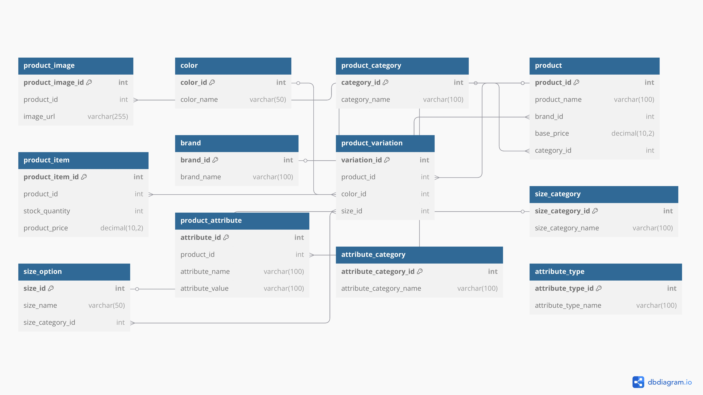

# 🛒 E-Commerce Database Design

This project is a database schema for an e-commerce platform, created as part of our Peer Group Assignment.

## 📦 Overview

The database contains tables for:
- Products and their variations (size, color)
- Product categories and attributes
- Brands
- Images
- Sizes
- Custom attributes

## 🗃️ Main Tables

- `product`
- `product_item`
- `product_variation`
- `color`
- `size_category`
- `size_option`
- `product_category`
- `product_image`
- `brand`
- `product_attribute`
- `attribute_category`
- `attribute_type`

## 🧠 ERD (Entity-Relationship Diagram)

Here is the visual representation of the database structure:

  

## 📦 Data Flow in the E-commerce Database

1. **Product Creation & Storage**:
   - A `product` represents the main entity in the database. It includes general details like the name, brand, and base price.
   - Each `product` belongs to a category in the `product_category` table (e.g., electronics, clothing).
   - The `brand` table stores the brand of each product.

2. **Product Item Variations**:
   - Each `product` can have one or more `product_items`. These are specific variations of the product (e.g., a specific color or size of a t-shirt).
   - These variations are stored in the `product_variation` table, linking the `product_id` to its variations.
   
3. **Color & Size Options**:
   - The `color` table stores available color options for products (e.g., Red, Blue, Green).
   - The `size_option` table lists specific size options for products (e.g., S, M, L, 42, etc.), categorized by `size_category`.

4. **Product Images**:
   - Images of each `product` are stored in the `product_image` table, with a reference to the `product_id`.
   - The `image_url` stores the path or URL to the product image, which can be displayed on the front-end.

5. **Product Attributes**:
   - Additional attributes like material or weight are stored in the `product_attribute` table, with custom attributes categorized under `attribute_category`.
   - Attribute types (text, number, boolean) are stored in the `attribute_type` table.

6. **Relationships Between Tables**:
   - A `product` is linked to many `product_items`, each of which may have different `product_variations`.
   - A `product_item` can have one or more `product_images` and may belong to a `color` and/or a `size_option`.
   - The `product_attribute` table links attributes to products using the `product_id`.

### Example Data Flow

Let’s consider a scenario where a user wants to purchase a t-shirt:

- **Step 1**: The user browses the **product catalog**, selecting the `product` (e.g., a "Red T-shirt").
- **Step 2**: The system queries the `product_item` table to find variations of the t-shirt (e.g., size `M`, color `Red`).
- **Step 3**: The system fetches relevant **product images** from the `product_image` table and displays them.
- **Step 4**: The user selects their preferred size and color.
- **Step 5**: The `product_variation` links the `product_item` with the selected `size_option` and `color`.
- **Step 6**: The checkout process occurs where the user’s cart stores the `product_item` details.

## 📄 How to Read the Data Flow

- **Entities**: `product`, `product_item`, `product_image`, `product_category`, etc.
- **Relationships**: Foreign keys and links (e.g., `product_id` linking `product_item` to `product`).
- **Business Process**: From product selection → item variations → checkout.


## 📂 How to Use

To create the database, run the `ecommerce.sql` file using your SQL database engine (e.g., MySQL Workbench):

```sql
SOURCE C:\\Users\\drelm\\Documents\\ecommercedatabase\\ecommerce.sql;
```
### Sample Queries
## Get all products with their Brand and categories
```sql
SELECT p.product_name, b.brand_name, pc.category_name
FROM product p
JOIN brand b ON p.brand_id = b.brand_id
JOIN product_category pc ON p.category_id = pc.category_id;
```
## Find available product items with color and size
```sql
SELECT p.product_name, pi.sku, pi.price, c.color_name, so.size_value
FROM product_item pi
JOIN product p ON pi.product_id = p.product_id
LEFT JOIN color c ON pi.color_id = c.color_id
LEFT JOIN size_option so ON pi.size_id = so.size_id
WHERE pi.quantity_in_stock > 0;
```
### 🤝 Contributors
- Team Member 1

- Nelly Maritim

- Team Member 3
